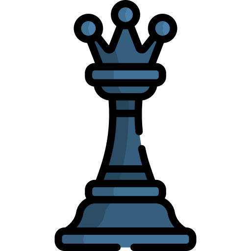

# Chess

This is an open chess tournament where ANYONE can play. That's the fun part.  
It's your turn to play! Move a <!-- BEGIN TURN -->black<!-- END TURN --> piece.

<!-- BEGIN CHESS BOARD -->
|   | A | B | C | D | E | F | G | H |   |
|---|:-:|:-:|:-:|:-:|:-:|:-:|:-:|:-:|:-:|
| **8** |  |  |  |  |  |  |  |  | **8** |
| **7** |  |  |  |  |  |  |  |  | **7** |
| **6** |  |  |  |  |  |  |  |  | **6** |
| **5** |  |  |  |  |  |  |  |  | **5** |
| **4** |  |  |  |  |  |  |  |  | **4** |
| **3** |  |  |  |  |  |  |  |  | **3** |
| **2** |  |  |  |  |  |  |  |  | **2** |
| **1** |  |  |  |  |  |  |  |  | **1** |
|   | **A** | **B** | **C** | **D** | **E** | **F** | **G** | **H** |   |
<!-- END CHESS BOARD -->

**It's your turn to move! Choose one from the following table**
<!-- BEGIN MOVES LIST -->
|  FROM  | TO (Just click a link!) |
| :----: | :---------------------- |
| **A6** | [A5](https://github.com/ntaheij/chess/issues/new?body=Please+do+not+change+the+title.+Just+click+%22Submit+new+issue%22.+You+don%27t+need+to+do+anything+else+%3AD&title=Chess%3A+Move+A6+to+A5) |
| **A8** | [A7](https://github.com/ntaheij/chess/issues/new?body=Please+do+not+change+the+title.+Just+click+%22Submit+new+issue%22.+You+don%27t+need+to+do+anything+else+%3AD&title=Chess%3A+Move+A8+to+A7), [B8](https://github.com/ntaheij/chess/issues/new?body=Please+do+not+change+the+title.+Just+click+%22Submit+new+issue%22.+You+don%27t+need+to+do+anything+else+%3AD&title=Chess%3A+Move+A8+to+B8), [C8](https://github.com/ntaheij/chess/issues/new?body=Please+do+not+change+the+title.+Just+click+%22Submit+new+issue%22.+You+don%27t+need+to+do+anything+else+%3AD&title=Chess%3A+Move+A8+to+C8) |
| **B7** | [B5](https://github.com/ntaheij/chess/issues/new?body=Please+do+not+change+the+title.+Just+click+%22Submit+new+issue%22.+You+don%27t+need+to+do+anything+else+%3AD&title=Chess%3A+Move+B7+to+B5), [B6](https://github.com/ntaheij/chess/issues/new?body=Please+do+not+change+the+title.+Just+click+%22Submit+new+issue%22.+You+don%27t+need+to+do+anything+else+%3AD&title=Chess%3A+Move+B7+to+B6) |
| **D6** | [D5](https://github.com/ntaheij/chess/issues/new?body=Please+do+not+change+the+title.+Just+click+%22Submit+new+issue%22.+You+don%27t+need+to+do+anything+else+%3AD&title=Chess%3A+Move+D6+to+D5) |
| **D8** | [A5](https://github.com/ntaheij/chess/issues/new?body=Please+do+not+change+the+title.+Just+click+%22Submit+new+issue%22.+You+don%27t+need+to+do+anything+else+%3AD&title=Chess%3A+Move+D8+to+A5), [B6](https://github.com/ntaheij/chess/issues/new?body=Please+do+not+change+the+title.+Just+click+%22Submit+new+issue%22.+You+don%27t+need+to+do+anything+else+%3AD&title=Chess%3A+Move+D8+to+B6), [B8](https://github.com/ntaheij/chess/issues/new?body=Please+do+not+change+the+title.+Just+click+%22Submit+new+issue%22.+You+don%27t+need+to+do+anything+else+%3AD&title=Chess%3A+Move+D8+to+B8), [C7](https://github.com/ntaheij/chess/issues/new?body=Please+do+not+change+the+title.+Just+click+%22Submit+new+issue%22.+You+don%27t+need+to+do+anything+else+%3AD&title=Chess%3A+Move+D8+to+C7), [C8](https://github.com/ntaheij/chess/issues/new?body=Please+do+not+change+the+title.+Just+click+%22Submit+new+issue%22.+You+don%27t+need+to+do+anything+else+%3AD&title=Chess%3A+Move+D8+to+C8), [D7](https://github.com/ntaheij/chess/issues/new?body=Please+do+not+change+the+title.+Just+click+%22Submit+new+issue%22.+You+don%27t+need+to+do+anything+else+%3AD&title=Chess%3A+Move+D8+to+D7) |
| **E4** | [D3](https://github.com/ntaheij/chess/issues/new?body=Please+do+not+change+the+title.+Just+click+%22Submit+new+issue%22.+You+don%27t+need+to+do+anything+else+%3AD&title=Chess%3A+Move+E4+to+D3), [E3](https://github.com/ntaheij/chess/issues/new?body=Please+do+not+change+the+title.+Just+click+%22Submit+new+issue%22.+You+don%27t+need+to+do+anything+else+%3AD&title=Chess%3A+Move+E4+to+E3), [F3](https://github.com/ntaheij/chess/issues/new?body=Please+do+not+change+the+title.+Just+click+%22Submit+new+issue%22.+You+don%27t+need+to+do+anything+else+%3AD&title=Chess%3A+Move+E4+to+F3) |
| **E6** | [A2](https://github.com/ntaheij/chess/issues/new?body=Please+do+not+change+the+title.+Just+click+%22Submit+new+issue%22.+You+don%27t+need+to+do+anything+else+%3AD&title=Chess%3A+Move+E6+to+A2), [B3](https://github.com/ntaheij/chess/issues/new?body=Please+do+not+change+the+title.+Just+click+%22Submit+new+issue%22.+You+don%27t+need+to+do+anything+else+%3AD&title=Chess%3A+Move+E6+to+B3), [C4](https://github.com/ntaheij/chess/issues/new?body=Please+do+not+change+the+title.+Just+click+%22Submit+new+issue%22.+You+don%27t+need+to+do+anything+else+%3AD&title=Chess%3A+Move+E6+to+C4), [C8](https://github.com/ntaheij/chess/issues/new?body=Please+do+not+change+the+title.+Just+click+%22Submit+new+issue%22.+You+don%27t+need+to+do+anything+else+%3AD&title=Chess%3A+Move+E6+to+C8), [D5](https://github.com/ntaheij/chess/issues/new?body=Please+do+not+change+the+title.+Just+click+%22Submit+new+issue%22.+You+don%27t+need+to+do+anything+else+%3AD&title=Chess%3A+Move+E6+to+D5), [D7](https://github.com/ntaheij/chess/issues/new?body=Please+do+not+change+the+title.+Just+click+%22Submit+new+issue%22.+You+don%27t+need+to+do+anything+else+%3AD&title=Chess%3A+Move+E6+to+D7), [F7](https://github.com/ntaheij/chess/issues/new?body=Please+do+not+change+the+title.+Just+click+%22Submit+new+issue%22.+You+don%27t+need+to+do+anything+else+%3AD&title=Chess%3A+Move+E6+to+F7) |
| **E8** | [D7](https://github.com/ntaheij/chess/issues/new?body=Please+do+not+change+the+title.+Just+click+%22Submit+new+issue%22.+You+don%27t+need+to+do+anything+else+%3AD&title=Chess%3A+Move+E8+to+D7), [F7](https://github.com/ntaheij/chess/issues/new?body=Please+do+not+change+the+title.+Just+click+%22Submit+new+issue%22.+You+don%27t+need+to+do+anything+else+%3AD&title=Chess%3A+Move+E8+to+F7) |
| **G7** | [G5](https://github.com/ntaheij/chess/issues/new?body=Please+do+not+change+the+title.+Just+click+%22Submit+new+issue%22.+You+don%27t+need+to+do+anything+else+%3AD&title=Chess%3A+Move+G7+to+G5), [G6](https://github.com/ntaheij/chess/issues/new?body=Please+do+not+change+the+title.+Just+click+%22Submit+new+issue%22.+You+don%27t+need+to+do+anything+else+%3AD&title=Chess%3A+Move+G7+to+G6) |
| **G8** | [F6](https://github.com/ntaheij/chess/issues/new?body=Please+do+not+change+the+title.+Just+click+%22Submit+new+issue%22.+You+don%27t+need+to+do+anything+else+%3AD&title=Chess%3A+Move+G8+to+F6), [H6](https://github.com/ntaheij/chess/issues/new?body=Please+do+not+change+the+title.+Just+click+%22Submit+new+issue%22.+You+don%27t+need+to+do+anything+else+%3AD&title=Chess%3A+Move+G8+to+H6) |
| **H7** | [H5](https://github.com/ntaheij/chess/issues/new?body=Please+do+not+change+the+title.+Just+click+%22Submit+new+issue%22.+You+don%27t+need+to+do+anything+else+%3AD&title=Chess%3A+Move+H7+to+H5), [H6](https://github.com/ntaheij/chess/issues/new?body=Please+do+not+change+the+title.+Just+click+%22Submit+new+issue%22.+You+don%27t+need+to+do+anything+else+%3AD&title=Chess%3A+Move+H7+to+H6) |
<!-- END MOVES LIST -->

Having fun? Ask a friend to do the next move!

#### How it works

When you click on a link and submit a new issue with the desired move, a GitHub action is triggered, which in turn runs a small python script that performs the specified movement, updates this README file and commits the changes.

Have you spotted a bug? Something missing? Feel free to open an [issue](https://github.com/ntaheij/chess/issues) and I will try to fix it as soon as possible :D

  
Last 5 moves in this game

<!-- BEGIN LAST MOVES -->

| Move | Author |
| :--: | :----- |
| `D2` to `D3` | [ @ntaheij](https://github.com/ntaheij) |
| `D5` to `E4` | [ @Luke0x22918](https://github.com/Luke0x22918) |
| `E3` to `E4` | [ @ntaheij](https://github.com/ntaheij) |
| `C8` to `E6` | [ @Luukvdijk](https://github.com/Luukvdijk) |
| `D3` to `E2` | [ @ntaheij](https://github.com/ntaheij) |

<!-- END LAST MOVES -->

  
Top 10 most moves across all games

<!-- BEGIN TOP MOVES -->

| Total moves |  User  |
| :---------: | :----- |
| 9 | [@ntaheij](https://github.com/ntaheij) |
| 5 | [@Luke0x22918](https://github.com/Luke0x22918) |
| 3 | [@Luukvdijk](https://github.com/Luukvdijk) |
| 1 | [@CorneHQ](https://github.com/CorneHQ) |
| 1 | [@stan754](https://github.com/stan754) |
| 1 | [@k1l0b1t](https://github.com/k1l0b1t) |
| 1 | [@lokerhp](https://github.com/lokerhp) |

<!-- END TOP MOVES -->

---
